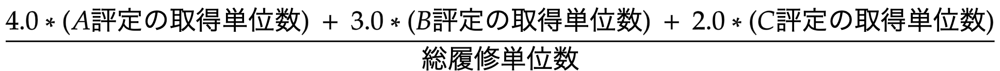

# CalcGPA
## GPA計算方法

## 利用方法
1. 学務システムにアクセスする。
2. 「成績・試験」→「単位修得状況照会」で修得状況を画面に表示する。
3. 「●単位修得状況」の表をコピーしてエクセルにペーストする。
4. csvファイルとしてダウンロードする。(ファイル名は `GPAdata.csv` とする。)
5. csvファイルとコードを同一ディレクトリに置き、 `python calcgpa.py` を実行する。
